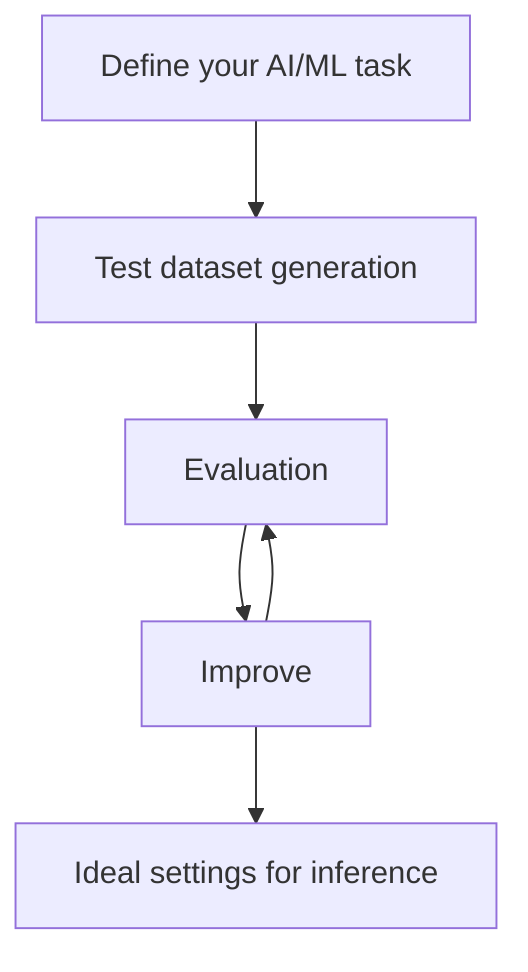
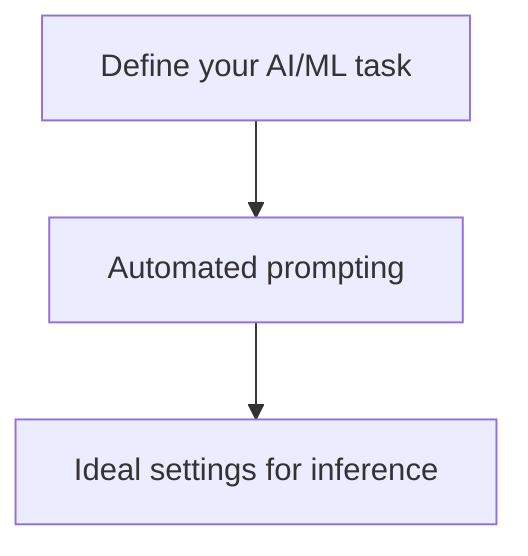

# 🧚🏻‍️ YiVal

⚡ Build any AIGC application with evaluation and improvement ⚡

Check our main website [here]().

👉 Follow us: [](https://twitter.com/yivalloveaigc) | 
[](https://discord.gg/UBWW23E3)

[](https://pepy.tech/project/YiVal)
[](https://opensource.org/licenses/MIT)
[](https://star-history.com/#YiVal/YiVal)
[](https://libraries.io/github/YiVal/YiVal)
[](https://github.com/YiVal/YiVal/issues)
[](https://codespaces.new/YiVal/YiVal)

**Production Support:** As you move your YiVal into production, we'd love to offer more hands-on support.
Fill out [this form]() to share more about your use cases, and our team try our best to support !

## 🤔 What is YiVal?

YiVal is an AIGC-Ops framework that allows you to iteratively tune your **AIGC model metadata, prompts and retrieval
configs** all at once with your preferred choices of test dataset generation, evaluation algorithms and improvement strategies(RLHF
or algorithm
based). [Check out our quickstart guide!]() →

🔧 Experiment Mode:



🤖 Agent Mode (Auto-prompting):



## Installation

```sh
pip install yival
```


### Fun Cast Fortune Telling

Dive into the world of YiChing and discover your fortune on our index page.
A fun and interactive way to get started with Yival.


## Demo

### Basic Interactive Mode

To get started with a demo for basic interactive mode of YiVal,
run the following command:

```sh
yival demo --basic_interactive
```

Once started, navigate to the following address in your web browser:

<http://127.0.0.1:8073/interactive>


For more details on this demo,
check out the [Basic Interactive Mode Demo].

[Basic Interactive Mode Demo]:https://github.com/YiVal/YiVal/blob/master/docs/basic_interactive_mode.md#demo

### Question Answering with expected result evaluator

```sh
yival demo --qa_expected_results
```

Once started, navigate to the following address in your web browser:

<http://127.0.0.1:8073/>


For more details on this demo,
check out the [Question Answering with expected result evaluator].

[Question Answering with expected result evaluator]:https://github.com/YiVal/YiVal/blob/master/docs/qa_expected_results.md#demo

### Auto prompts generation

```sh
yival demo --auto_prompts
```


For more details on this demo,
check out the [Auto prompts generation].

[Auto prompts generation]:https://github.com/YiVal/YiVal/blob/master/docs/auto_prompts_generation.md#demo
