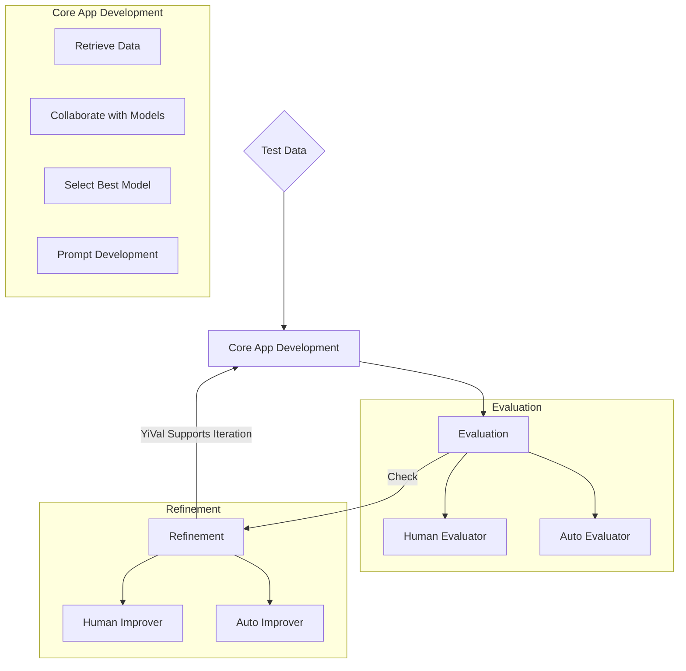

# YiVal: Adaptable AI Development Framework

YiVal stands at the intersection of flexibility
and adaptability in the AI development landscape.
Crafted meticulously for those who seek a tailored experimentation experience,
it effortlessly caters to both hands-on developers and those who lean into automation.

## Table of Contents

- [YiVal: Adaptable AI Development Framework](#yival-adaptable-ai-development-framework)
    - [Table of Contents](#table-of-contents)
    - [Overview](#overview)
        - [Fun Cast Fortune Telling](#fun-cast-fortune-telling)
        - [Experimentation](#experimentation)
        - [Additional Features](#additional-features)
    - [AIGC app development flow](#aigc-app-development-flow)
    - [Installation](#installation)
    - [Demo](#demo)
        - [Basic Interactive Mode](#basic-interactive-mode)
        - [Question Answering with expected result evaluator](#question-answering-with-expected-result-evaluator)
        - [Auto prompts generation](#auto-prompts-generation)

## Overview

At its core, YiVal is more than just a framework—it's a philosophy.
A philosophy that believes in offering tools
that can be seamlessly molded to fit unique experimentation needs.
With a robust architecture and versatile components,
Yival ensures that every AI journey,
regardless of its complexity, is smooth and efficient.

### Fun Cast Fortune Telling

Dive into the world of YiChing and discover your fortune on our index page.
A fun and interactive way to get started with Yival.


### Experimentation

- **Experiment Result Analysis**:
    Gain insights into aggregated outputs for each combination,
    evaluator outcomes, average latency, token usage, and sample test case results.
    The best combinations will be highlighted for ease of reference.

    

- **Data Analysis Page**:
    Delve deep into your experiment data,
    extracting meaningful insights and patterns that can guide further experimentation.

    

- **Detailed Test Results**:
    A granular look at each test case result for every combination,
    providing a comprehensive understanding of the experiment's outcomes.

    

- **Improver Experiment Result Analysis**:
    After the improvement phase, see the aggregated outputs for each combination.
    This includes evaluator outputs, average latency, token usage,
    and sample test cases, with the best combinations highlighted.

    

- **Improver Detailed Test Results**:
    Post-improvement,
    this page offers a detailed view of each test case result for every combination,
    showcasing the enhancement in results.

    

### Additional Features

- **Export Data**:
    Securely store and export your experiment for future reference
    or to share with peers.

    

- **Rating**:
    Human touch matters.
    Add ratings to each test case on the experiment results page
    based on configurable criteria.

    

- **Interactive Mode**:
    Flexibility at its best.
    Enter new test cases for combinations,
    tailoring your experimentation in real-time.

    

## AIGC app development flow

The flowchart below depicts the core flow of ideal AI Generated Content (AIGC)
app development that Yival tries to support.
This emphasis on iteration ensures a continuous cycle of improvement,
allowing developers to hone their applications to perfection.



## Installation

```sh
pip install yival
```

## Demo

With just the creation of a configuration file, you can easily use yival to evaluate different experiment environments, fitting unique experimentation needs. For example , we can define a pipeline that XX as follow :

```
# yaml
```

### Write landing page headlines for statups

<!-- we provide Google Colab demo for you to experience YiVal's functionality without any setup required, which is a great way to get a hands-on feel for what is Yival!

#### Write landing page headlines for statups -->

[](https://colab.research.google.com/drive/1EiWUL8rE_kfNLXVPowCWCh6hwHFagvs_?usp=sharing)

In this demo, we aim to find the optimal prompt that allows GPT-4 to generate landing page headlines based on company names. In this demo, LLM not only generates the prompt and test data, but also evaluates the results and selects the optimal prompt.

### Basic Interactive Mode

To get started with a demo for basic interactive mode of YiVal,
run the following command:

```sh
yival demo --basic_interactive
```

Once started, navigate to the following address in your web browser:

<http://127.0.0.1:8073/interactive>


For more details on this demo,
check out the [Basic Interactive Mode Demo].

[Basic Interactive Mode Demo]:https://github.com/YiVal/YiVal/blob/master/docs/basic_interactive_mode.md#demo

### Question Answering with expected result evaluator

```sh
yival demo --qa_expected_results
```

Once started, navigate to the following address in your web browser:

<http://127.0.0.1:8073/>


For more details on this demo,
check out the [Question Answering with expected result evaluator].

[Question Answering with expected result evaluator]:https://github.com/YiVal/YiVal/blob/master/docs/qa_expected_results.md#demo

### Auto prompts generation

```sh
yival demo --auto_prompts
```


For more details on this demo,
check out the [Auto prompts generation].

[Auto prompts generation]:https://github.com/YiVal/YiVal/blob/master/docs/auto_prompts_generation.md#demo
