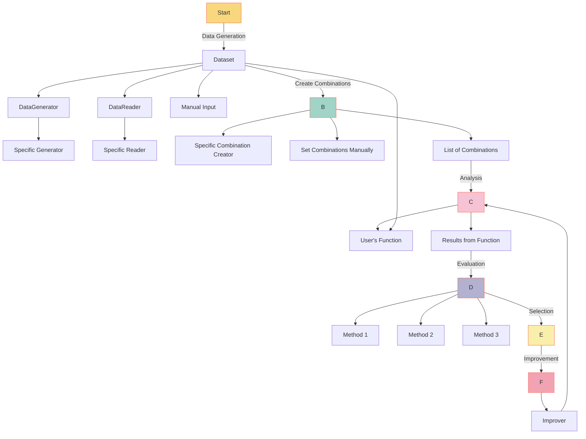

# YiVal: Adaptable AI Development Framework

YiVal stands at the intersection of flexibility and adaptability in the AI development landscape. Crafted meticulously for those who seek a tailored experimentation experience, it effortlessly caters to both hands-on developers and those who lean into automation.

## Table of Contents

- [YiVal: Adaptable AI Development Framework](#yival-adaptable-ai-development-framework)
    - [Table of Contents](#table-of-contents)
    - [Overview](#overview)
        - [Fun Cast Fortune Telling](#fun-cast-fortune-telling)
        - [Experimentation](#experimentation)
        - [Additional Features](#additional-features)
    - [Architecture](#architecture)
        - [Data Generation](#data-generation)
        - [Combination Creation](#combination-creation)
        - [Analysis](#analysis)
        - [Evaluation](#evaluation)
        - [Selection](#selection)
        - [Improvement](#improvement)
    - [Installation](#installation)
    - [Demo](#demo)
        - [Basic Interactive Mode](#basic-interactive-mode)

## Overview

At its core, YiVal is more than just a framework—it's a philosophy. A philosophy that believes in offering tools that can be seamlessly molded to fit unique experimentation needs. With a robust architecture and versatile components, Yival ensures that every AI journey, regardless of its complexity, is smooth and efficient.

<details>
<summary> Web UI</summary>

### Fun Cast Fortune Telling

Dive into the world of YiChing and discover your fortune on our index page. A fun and interactive way to get started with Yival.


### Experimentation

- **Experiment Result Analysis**: Gain insights into aggregated outputs for each combination, evaluator outcomes, average latency, token usage, and sample test case results. The best combinations will be highlighted for ease of reference.


- **Data Analysis Page**: Delve deep into your experiment data, extracting meaningful insights and patterns that can guide further experimentation.


- **Detailed Test Results**: A granular look at each test case result for every combination, providing a comprehensive understanding of the experiment's outcomes.


- **Improver Experiment Result Analysis**: After the improvement phase, see the aggregated outputs for each combination. This includes evaluator outputs, average latency, token usage, and sample test cases, with the best combinations highlighted.


- **Improver Detailed Test Results**: Post-improvement, this page offers a detailed view of each test case result for every combination, showcasing the enhancement in results.


### Additional Features

- **Export Data**: Securely store and export your experiment for future reference or to share with peers.


- **Rating**: Human touch matters. Add ratings to each test case on the experiment results page based on configurable criteria.


- **Interactive Mode**: Flexibility at its best. Enter new test cases for combinations, tailoring your experimentation in real-time.


</details>

## Architecture

### Data Generation

The process starts with the generation of a dataset which can come from multiple sources:

- **Specific Data Generator**: A defined method or algorithm that automatically churns out data.
- **Data Reader**: A component that reads data from external places.
- **Manual Input**: As straightforward as it sounds, data can be added manually.

### Combination Creation

Once we have our dataset, we form combinations that are pivotal for the subsequent analysis:

- Formed using specific combination creators.
- Defined manually.

### Analysis

This is the heart of the Yival framework. A custom function provided by the user takes in the dataset and combination list to produce valuable insights.

### Evaluation

After analysis, the results are subjected to evaluation. Several methodologies can be applied to grasp and gauge the data's behavior deeply.

### Selection

From the evaluations, the most promising results are selected. This process ensures only the most vital insights are pushed forward.

### Improvement

The selected results are then fine-tuned in this phase. An "Improver" is applied to enhance these results. This stage can loop back to the analysis stage, indicating an ongoing, iterative process of refinement.



## Installation

```
pip install yival
```

## Demo

### Basic Interactive Mode

To get started with a demo of YiVal, run the following command:

```
yival demo --basic_interactive
```

Once started, navigate to the following address in your web browser:

<http://127.0.0.1:8073/interactive>
<details>
  <summary>Click to view the screenshot</summary>
  
  
  
</details>

For more details on our demo, check out the [Basic Interactive Mode Demo](https://github.com/YiVal/YiVal/blob/master/docs/docs/basic_interactive_mode.md#demo).
