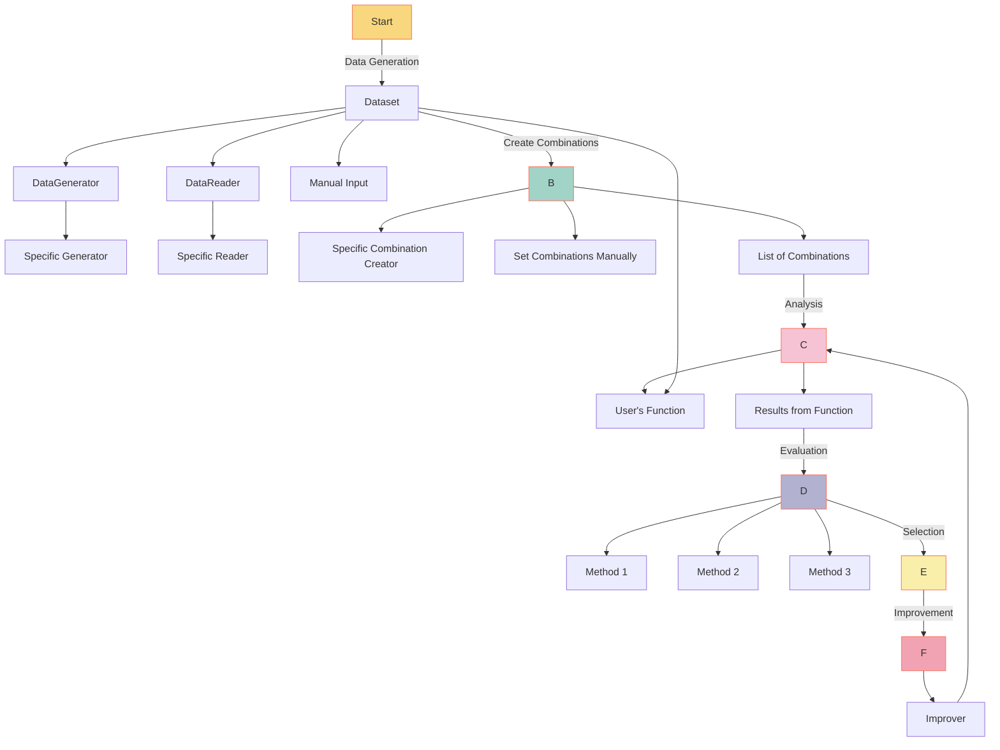

# Architecture

## Data Generation

The process starts with the generation of a dataset which can come from multiple sources:

- **Specific Data Generator**: A defined method or algorithm that automatically churns out data.
- **Data Reader**: A component that reads data from external places.
- **Manual Input**: As straightforward as it sounds, data can be added manually.

## Combination Creation

Once we have our dataset, we form combinations that are pivotal for the subsequent analysis:

- Formed using specific combination creators.
- Defined manually.

## Analysis

This is the heart of the Yival framework. A custom function provided by the user
takes in the dataset and combination list to produce valuable insights.

## Evaluation

After analysis, the results are subjected to evaluation. Several methodologies
can be applied to grasp and gauge the data's behavior deeply.

## Selection

From the evaluations, the most promising results are selected. This process
ensures only the most vital insights are pushed forward.

## Improvement

The selected results are then fine-tuned in this phase. An "Improver" is applied
to enhance these results. This stage can loop back to the analysis stage, indicating an ongoing, iterative process of refinement.
