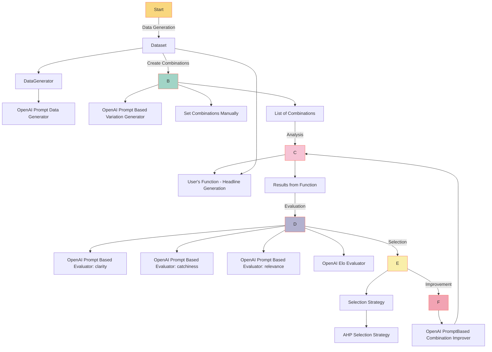

# Auto Prompts Generation

## Overview

This document describes the engineering specification for the basic interactive
mode in the YiVal framework.

## Flow Diagram



## Specifications

### Data Generator

We use open ai to help us generate test cases

```yaml
dataset:
  data_generators:
    openai_prompt_data_generator:
      chunk_size: 1000
      diversify: false
      input_function:
        description:
          Given an tech startup business, generate a corresponding landing
          page headline
        name: headline_generation_for_tech_startup_business
        parameters:
          tech_startup_business: str
      number_of_examples: 2
      openai_model_name: gpt-4
      output_path: test_demo_generated_examples.pkl
      prompt: |-
        Please provide a concrete and realistic test case as
        a dictionary for function invocation using the ** operator.
        Only include parameters, excluding description and name and ensure
        it's succinct and well-structured.

        **Only provide the dictionary.**

  source_type: machine_generated
```

- **diversify**: Whether to diversify the generated results. If set to true,
                 parallel processing of data generation is not possible.
- **input_function**: Description and parameters for the function.
- **number_of_examples**: Number of examples to be generated.
- **output_path**: Temporary output path for the generated data. If this file exists,
                   the data will be read from it.
- **prompt**: The prompt used to generate the data.

### Custom Function

The custom function for this mode is hosted on GitHub.
You can find and review it [here](https://github.com/YiVal/YiVal/blob/master/src/yival/demo/headline_generation.py).

In this function, we take in an input that represents tech startup business, and
will otuput headline for the landing page.

We make use of the `StringWrapper` to enclose placeholders intended for replacement,
based on the variations configuration. This wrapped string essentially serves
as a namespace:

```python
    str(
        StringWrapper(
            template="""
            Generate a landing page headline for {tech_startup_business}
            """,
            variables={
                "tech_startup_business": tech_startup_business,
            },
            name="task"
            )
        )
```

Within the `StringWrapper`, instead of a raw string, we utilize a template. This
template integrates both text and variables. The variables are encapsulated
within `{}` braces. In the example provided, the variable is `tech_startup_business`.

### Variations Generation

We have configured variations using both ChatGPT and manual settings.
Here's the configuration for ChatGPT:

```yaml
variations:
  - name: task
    generator_name: openai_prompt_based_variation_generator
    generator_config:
      diversify: false
      max_tokens: 7000
      number_of_variations: 2
      openai_model_name: gpt-4
      output_path: test_demo_generated_prompt.pkl
      prompt:
        - content: |- 
            Prompt used to generate the varations. 
```

- **generator_name**: Represents the class name of the generator.
- **number_of_variations**: Specifies the number of variations to be generated.
- **output_path**: This is the temporary storage location for the generated data.
                   If a file at this path exists, the data is read from it.
- **prompt**: The prompts used to generate the variation.

For manual variations, the configuration is as follows:

```yaml
    variations:
      - instantiated_value: Generate landing page headline for {tech_startup_business}
        value: Generate landing page headline for {tech_startup_business}
        value_type: str
        variation_id: null
```

This manual setup defines a specific way the variation will be presented.

### Human Rating Configuration

Below is the configuration for human ratings:

<!-- markdownlint-disable MD013 -->
```yaml
human_rating_configs:

- name: clarity
    instructions: Evaluate the clarity of the headline: Does it precisely convey the startup's purpose?
    scale: [1, 5]

- name: relevance
    instructions: Assess the relevance of the headline: Is it pertinent to the subject matter?
    scale: [1, 5]
```
<!-- markdownlint-enable MD013 -->

**Explanation:**

- **name**: Specifies the criterion for rating.
- **instructions**: Provides guidelines to the rater on how to evaluate the content
                    based on the defined criterion.
- **scale**: The rating scale, where `1` is the lowest and `5` is the highest.

To better understand the configuration, refer to the screenshot below:


Certainly! Here's the revised description taking into account the context you provided:

---

### Automated Evaluation Configuration

Below is the setup for automated evaluations:

<!-- markdownlint-disable MD013 -->
```yaml
evaluators:
  - evaluator_type: all
    input_description:
      Given a tech startup business, produce a single corresponding landing
      page headline
    name: openai_elo_evaluator
    openai_model_name: gpt-4
  - evaluator_type: individual
    metric_calculators:
      - method: AVERAGE
    name: openai_prompt_based_evaluator
    prompt: |-
      You're tasked with evaluating an answer for a specific criterion based on the following information:
      - Task: Given a tech startup business, produce a single corresponding landing page headline
      - Question: Does the headline clearly convey the startup's mission or the problem it addresses?
        The headline should instantly provide clarity about the startup's objective to any reader. Ambiguities can deter potential users or investors.
      [Input]: {tech_startup_business}
      [Result]: {raw_output}
      Kindly rate the response based on the following options:
      A. Doesn't meet the criterion.
      B. Partially meets the criterion with significant scope for enhancement.
      C. Adequately meets the criterion.
      D. Meets the criterion impressively.
      E. Exemplarily meets the criterion, with negligible areas for improvement.
    display_name: clarity
    choices: ["A", "B", "C", "D", "E"]
    description: Does the headline lucidly articulate the startup's function or the issue it targets?
    scale_description: "0-4"
    choice_scores:
      A: 0
      B: 1
      C: 2
      D: 3
      E: 4
```
<!-- markdownlint-enable MD013 -->

**Explanation:**

- **evaluator_type**: Designates the type of evaluation.
    - `all`: The evaluator considers all experiment results across all variations.
        It uses the elo algorithm and employs GPT-4 as the judge.
    - `individual`: The evaluator focuses solely on the current variation's results.
- **input_description**: Describes the type of input the model expects.
- **name**: Represents the evaluator's name or identifier.
- **prompt**: Provides the template and context for the automated evaluator
    to assess a given result.
- **display_name**: Specifies the displayed criterion name on the user interface.
- **choices**: Lists all possible rating options for the evaluator.
- **description**: Offers a brief description of the evaluation criterion.
- **scale_description**: Details the numeric scoring scale.
- **choice_scores**: Maps each choice to its respective numeric score.

Certainly! Here's the polished description for the selection configuration:

---

### Selection Configuration

Below is the setup detailing the selection strategy:

```yaml
selection_strategy:
  ahp_selection:
    criteria:
      - openai_elo_evaluator
      - average_token_usage
      - average_latency
      - "openai_prompt_based_evaluator: clarity"
      - "openai_prompt_based_evaluator: relevance"
      - "openai_prompt_based_evaluator: catchiness"
    criteria_maximization:
      openai_elo_evaluator: true
      average_latency: false
      average_token_usage: false
    criteria_weights:
      openai_elo_evaluator: 0.3
      average_latency: 0.2
      average_token_usage: 0.2
      "openai_prompt_based_evaluator: clarity": 0.1
      "openai_prompt_based_evaluator: relevance": 0.1
      "openai_prompt_based_evaluator: catchiness": 0.1
```

**Explanation:**

- **selection_strategy**: Represents the overarching approach for making selections.
- **ahp_selection**: Specifies that the Analytic Hierarchy Process (AHP) algorithm
    is employed for the selection strategy.
- **criteria**: Lists the evaluators and metrics that are considered during
    the selection process.
- **criteria_maximization**: Indicates whether each criterion should be maximized.
    For instance,
    while a high score from the `openai_elo_evaluator` is desirable (`true`),
    a lower `average_latency` or `average_token_usage` is preferred (`false`).
- **criteria_weights**:
    Assigns a weight to each criterion,
    determining its importance in the overall evaluation.
    The weights sum up to 1, indicating the relative significance of each criterion
    in the final decision-making process.

---

### Auto Improver

Certainly! Here's the enhanced description, incorporating the additional information:

---

### Auto Improver Configuration

Below is the setup detailing the auto improver strategy:

```yaml
improver:
  name: openai_prompt_based_combination_improver
  max_iterations: 2
  openai_model_name: gpt-4
  stop_conditions:
    "openai_prompt_based_evaluator: catchiness": 3
    "openai_prompt_based_evaluator: clarity": 3
    "openai_prompt_based_evaluator: relevance": 3
```

**Explanation:**

- **name**: Specifies the identifier or the class of the improver.
    In this instance, `openai_prompt_based_combination_improver` is utilized.
- **max_iterations**: Designates the upper limit for the number of improvement cycles.
    The process will not exceed 2 iterations, irrespective of other conditions.
- **openai_model_name**:
    Indicates the model to be utilized for the improvement process,
    which here is `gpt-4`.
- **stop_conditions**:
    Outlines conditions under which the improver should halt its operations
    before reaching the maximum iteration count.
    The improvement process will terminate if the average score
    from any of the specified evaluators surpasses 3.

Additionally, it's important to note that during the improvement process, only
the best result from the previous selection step will be taken into consideration.
The idea is to refine and optimize this top-performing result further.

### Full Configuration

For a comprehensive view of all configurations related to the basic interactive mode,
you can review the full configuration file hosted [here](https://github.com/YiVal/YiVal/blob/master/src/yival/demo/configs/auto_prompts_config.yml).
