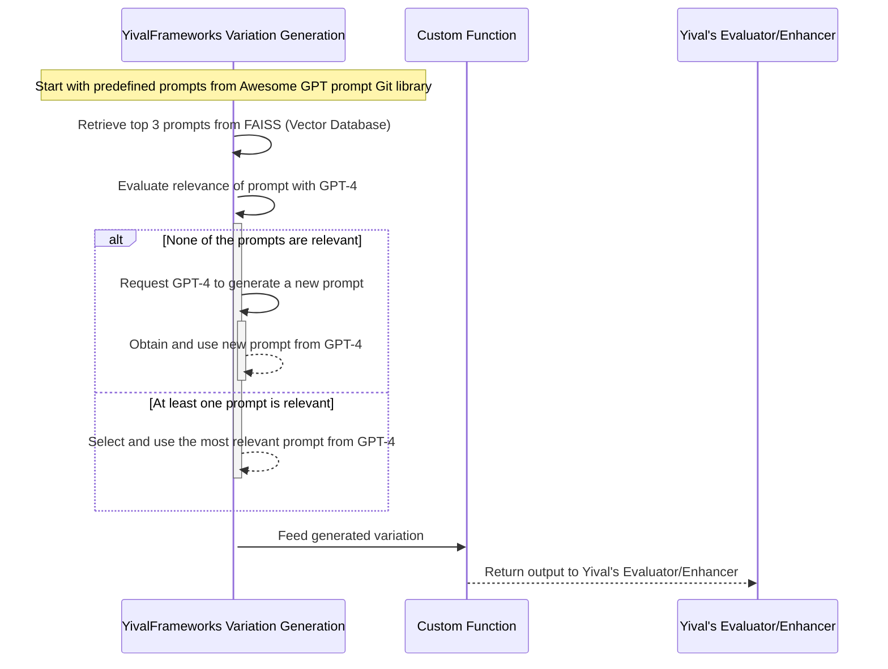

# Simplifying Prompt Generation for LLMs with Retrieval Methods

Working with Large Language Models (LLMs) like ChatGPT often involves feeding
them prompts: short texts that give the model direction on how to respond.
Manually crafting these prompts can be tedious. Wouldn't it be convenient if we
could automate this process, ensuring each prompt is contextually relevant?
Let's explore a method that does just that, using the Yival framework and the
FAISS vector database.

## **Why Automate Prompt Generation?**

Think of prompts as questions or instructions you give to ChatGPT. The more
precise the instruction, the better the model's answer. But crafting a new
instruction for every unique scenario is time-consuming. If we could automate
this, not only would it save time, but it'd also ensure the AI's responses are
consistently relevant.

## **Storing Prompts: FAISS to the Rescue**

We source a wide variety of prompts from [awesome-chatgpt-prompts](https://github.com/f/awesome-chatgpt-prompts).
To quickly find the best prompt for any situation:

- **We use FAISS**: This tool helps store prompts in a way that makes them quick
  to search and retrieve.
- **We turn prompts into 'vectors'**: By transforming prompts into a mathematical
  format (vectors), we can easily find the most fitting one for a given situation.

## **How Yival Helps in Retrieval**

Yival is like a toolbox that simplifies AI-related experimentation.
When integrated with FAISS, it streamlines the process of fetching the right prompt.

### **The Main Steps**

1. **Find Matching Prompts**: Based on a given situation, Yival searches the FAISS
    database to find similar prompts.
2. **Refine with GPT**: Sometimes, the initially found prompts might not be perfect.
    So, we use GPT to rerank them, ensuring we pick the most suitable one.

## **Putting It All Together**

With our setup, generating a prompt becomes straightforward. For ChatGPT,
here's a simple example of how we might use a generated prompt:

```python
# Create a chat message sequence
messages = [{
    "role": "user",
    "content": str(StringWrapper("", name="prompt")) + f'\n{input}'
}]
# Get a response from ChatGPT
response = openai.ChatCompletion.create(
    model="gpt-3.5-turbo", messages=messages
)
```

Notice that we didn't need to provide a predefined prompt. The system took care
of it!

## **A Peek at the Process**

### **Visual Flow**



This flowchart will give you a bird's-eye view of how everything connects, from
the moment we receive a use-case to generating the perfect prompt.

### **Results in Real-Time**


Here's an example of what the system's output looks like in action. This gives
you an idea of the kind of prompts it can generate and how ChatGPT might respond.

## **In Conclusion**

The world of AI is vast and sometimes complex. But tools like Yival and FAISS,
when combined with LLMs like ChatGPT, can make tasks like prompt generation much
simpler. By automating this process, we're taking a step towards more efficient
and context-aware AI interactions.

You can review the full code [here](https://github.com/YiVal/YiVal/tree/master/demo/prompts_retrivel)
