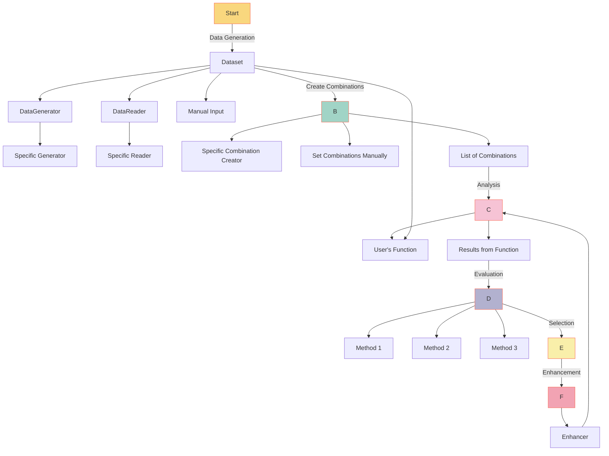

# **Introducing Yival: Prompt Development and Experimentation Simplified**

The landscape of Artificial Intelligence Generated Content (AIGC) applications
is evolving rapidly. In this dynamic environment, Yival offers a structured yet
flexible open-source framework tailored for AIGC app development and experimentation.

## **Yival's Architecture: Structured Flexibility**

Yival is designed with modularity at its core, providing a clear workflow to guide
users through the stages of AIGC app development.



A closer look at Yival's structured components:

**1. Data Generation:** The foundation of any AIGC application:

- **Specific Data Generator:** A tool designed to produce data based on predefined
                               parameters, often using models for generation.
- **Data Reader:** Integrates data from various external sources.
- **Manual Input:** For specific needs, direct data input is available.

**2. Combination Creation:** The next step involves crafting combinations,
                             pivotal in AIGC apps:

- Defined through specific tools or custom settings.
- Essentially, it's about defining and experimenting with parameters,
  such as the **prompt**.

**3. Evaluation:** After processing through a custom function, the output is
                   ready for assessment:

- **Model Evaluator:** Uses algorithms to determine the output's quality and relevance.
- **Human Rating:** Adds an element of human judgment for a more comprehensive evaluation.

**4. Selection:** Filters and emphasizes the most relevant outputs, ensuring focused
 results.

**5. Enhancement:** The framework offers tools to refine results:

- **Model-driven Enhancement:** Uses models like LLM for enhancement.
- **Human-guided Refinement:** Offers manual refinement options for specific needs.

One of Yival's distinguishing features is its adaptability. Its components are
designed to be interchangeable, allowing users to seamlessly integrate custom
classes or expand functionalities.

Check out our how to build your custom classes [here](https://yival.github.io/YiVal/custom_classes/evaluators/)

## **Getting Started with Yival**

**For the Beginners:** Launch with our pre-built demos. Simply:

1. **Basic Interactive Mode:**

   ```bash
   pip install yival
   yival demo --basic_interactive
   ```

   Dive deeper [here](https://yival.github.io/YiVal/basic_interactive_mode/).

2. **QA Expected Results:**

   ```bash
   yival demo --qa_expected_results
   ```

   Learn more [here](https://yival.github.io/YiVal/qa_expected_results/).

3. **Auto Prompts Generation:**

   ```bash
   yival demo --auto_prompts
   ```

   Additional details available [here](https://yival.github.io/YiVal/auto_prompts_generation/).

**For the Intermediates:** Experiment with the Yival framework on our [Colab notebook](https://colab.research.google.com/drive/1tr5s_adAPmI9Mv6Zz97JnTGIh3mGojsi?usp=sharing).

**For the Experts:** Delve into our open-source codebase on [GitHub](https://github.com/YiVal/YiVal/tree/master).

## **Open Source and Collaborative**

Yival is more than just a framework; it's an opportunity for collaboration. We
welcome contributions, insights, and feedback from the community.

**Explore Yival and redefine your AIGC development experience.**
