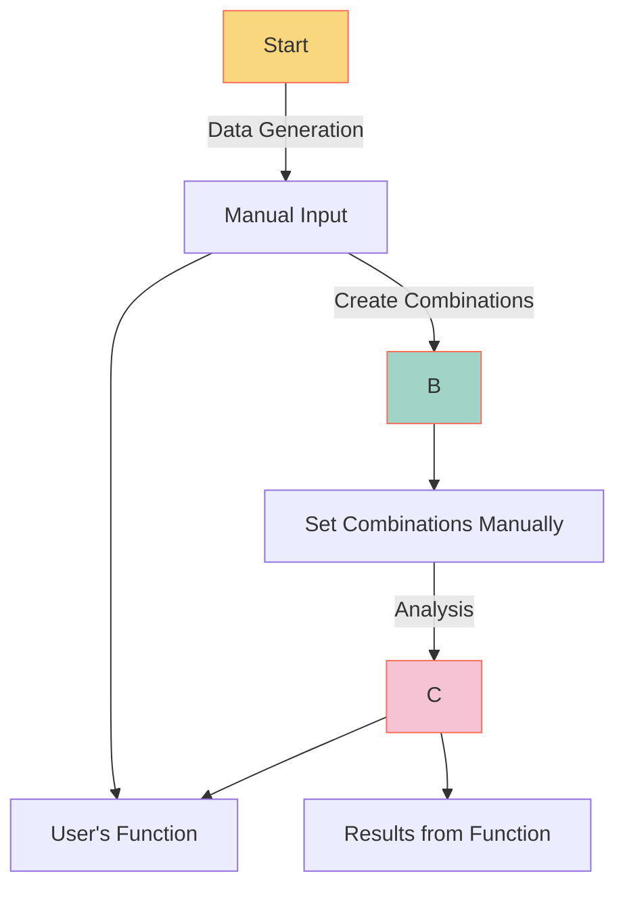

# Basic Interactive Mode

## Overview

This document describes the engineering specification
for the basic interactive mode in the YiVal framework.

## Flow Diagram



## Specifications

### Data Source

The data for this mode comes directly from the user input.
The configuration for this data source is as follows:

```yaml
dataset:
  source_type: user_input
```

### Custom Function

The custom function for this mode is hosted on GitHub.
You can find and review it [here](https://github.com/YiVal/YiVal/blob/master/src/yival/demo/translation.py).

Within this function, we utilize the `StringWrapper` to wrap places
that will be replaced based on the variations configuration.
The wrapped string acts as a namespace:

```python
str(
    StringWrapper(
        "Translate the following to Chinese", name="translate"
    )
) + f'{input}'
```

### Variations Configuration

The variations are defined in a configuration
that provides multiple instantiated values,
each corresponding to a different language.
Here's a snapshot:

```yaml
variations:
  - name: translate
    variations:
      - instantiated_value: "Translate the following to Chinese:"
        value: "Translate the following to Chinese"
        value_type: str
        variation_id: null
      - instantiated_value: "Translate the following to Spanish:"
        value: "Translate the following to Spanish"
        value_type: str
        variation_id: null
      - instantiated_value: "Translate the following to German:"
        value: "Translate the following to German"
        value_type: str
        variation_id: null
```

This configuration provides three variations,
allowing the text to be set in different languages.

### Full Configuration

For a comprehensive view of all configurations related to the basic interactive mode,
you can review the full configuration file hosted [here](https://github.com/YiVal/YiVal/blob/master/src/yival/demo/configs/basic_interactive_config.yml).
