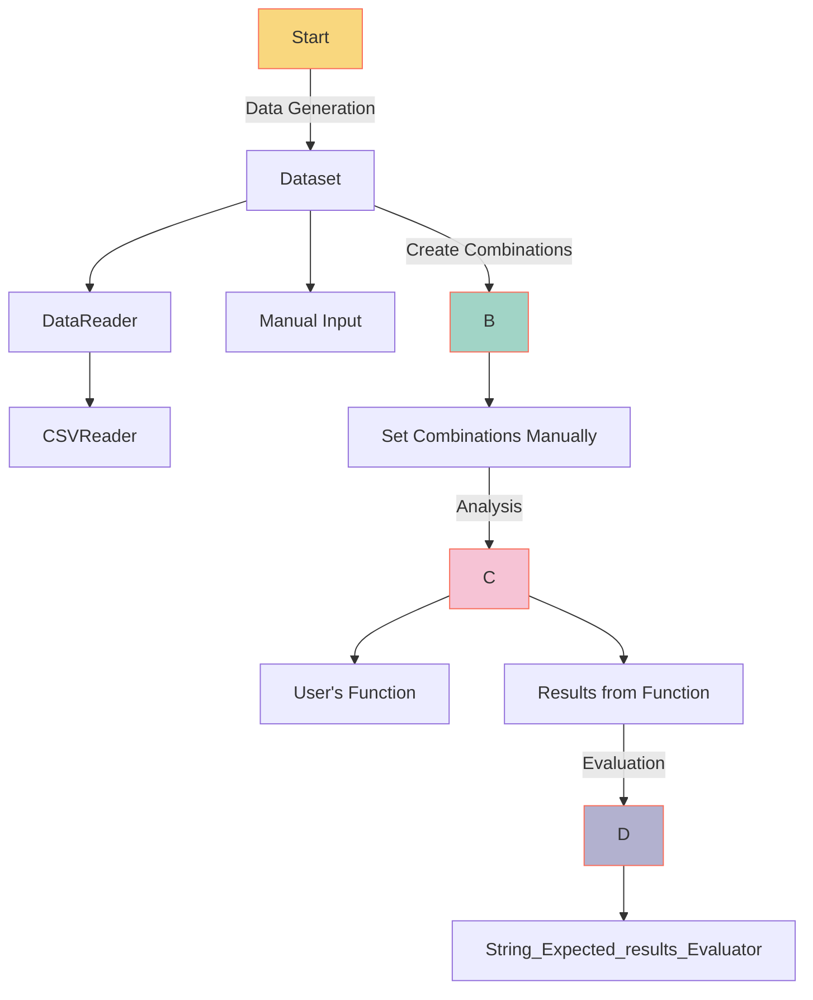

# Question Answering with Expected Results

## Overview

This documentation provides an insight into the basic reader and evaluator components within the Yival framework.

## Flow Diagram

To better understand the process, refer to the flow diagram below:



## Specifications

### Data Source

The data for this example is sourced from a CSV file that includes an `expected_result` column. Here's the configuration for the data source:

```yml
dataset:
  file_path: demo/data/yival_expected_results.csv
  reader: csv_reader
  source_type: dataset
  reader_config:
    expected_result_column: expected_result
```

### Custom Function

Our custom function tailored for this mode is hosted on GitHub. To delve into its details, please [click here](https://github.com/YiVal/YiVal/blob/master/src/yival/demo/qa.py).

In this function, the `StringWrapper` is employed to encapsulate parts of the string that will be substituted based on the variations configuration. This encapsulated string serves as a namespace:

```python
 "content": f'{input} ' + str(StringWrapper("", name="qa"))
```

### Variations Configuration

Variations are articulated in a dedicated configuration. This particular setup allows retaining the original empty suffix or appends a "Chain of Thought" suffix:

```yml
variations:
  - name: qa
    variations:
      - instantiated_value: ""
        value: ""
        value_type: str
        variation_id: null
      - instantiated_value: "Think first, then make a decision. Some random thoughts:"
        value: "Think first, then make a decision. Some random thoughts:"
        value_type: str
        variation_id: null
```

### Full Configuration

For those seeking an in-depth exploration of all configurations pertinent to the QA expected results demonstration, we recommend perusing the comprehensive configuration file available [here](https://github.com/YiVal/YiVal/blob/master/src/yival/demo/configs/qa_expected_results_config.yml).
