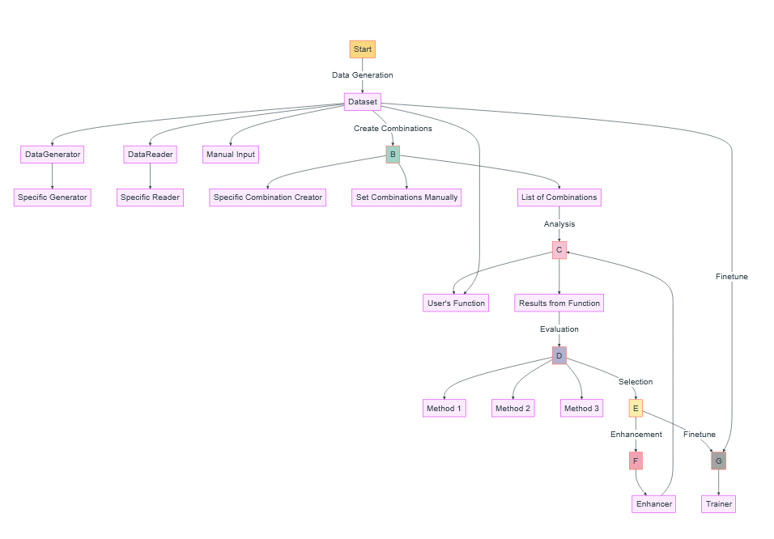

# Architecture

YiVal has a 7-layer architecture described below: 

## Data Generation

 The process starts with the generation of a dataset which can come from multiple sources:

- **Specific Data Generator**: A defined method or algorithm that automatically churns out data.
- **Data Reader**: A component that reads data from external places.
- **Manual Input**: As straightforward as it sounds, data can be added manually.

## Combination Creation 

 Once we have our dataset, we form combinations that are pivotal for the subsequent analysis:

- Formed using specific combination creators.
- Defined manually.

## Analysis 

 This is the heart of the Yival framework. A custom function provided by the user takes in the dataset and combination list to produce valuable insights.

## Evaluation

 After analysis, the results are subjected to evaluation. Several methodologies can be applied to grasp and gauge the data's behavior deeply.

## Selection 

 From the evaluations, the most promising results are selected. This process ensures only the most vital insights are pushed forward.

## Enhancer

 The selected results are then fine-tuned in this phase. An "Enhancer" is applied to enhance these results. This stage can loop back to the analysis stage, indicating an ongoing, iterative process of refinement.

## Trainer

 Yival also supports finetuning models, and we offer two methods:

- Use various dataset generators built into Yival (including Huggingface, etc.) for data upload or generation, and then finetune the model.
- Provide a custom_func, use advanced models like GPT-4 for data generation, and customize the selection criteria. The model is then fine-tuned based on the selected data.

 Yival supports all base models supported by Huggingface and provides advanced fine-tuning methods such as LoRA, and 8bit/4bit quantization.

