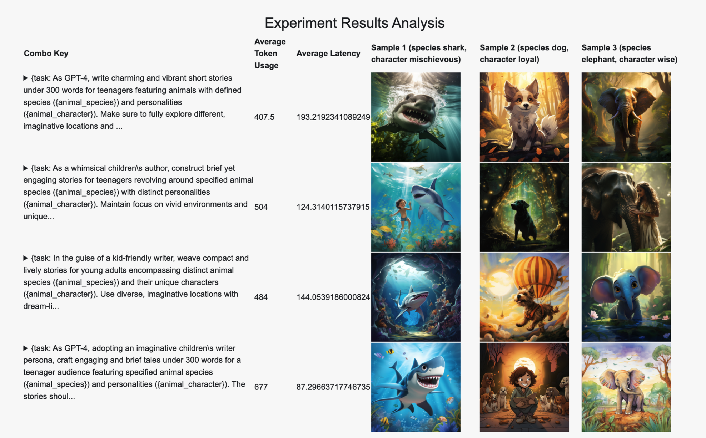
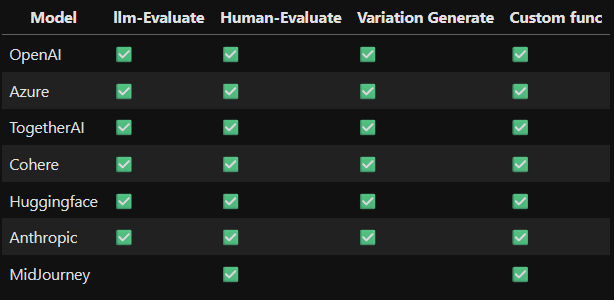
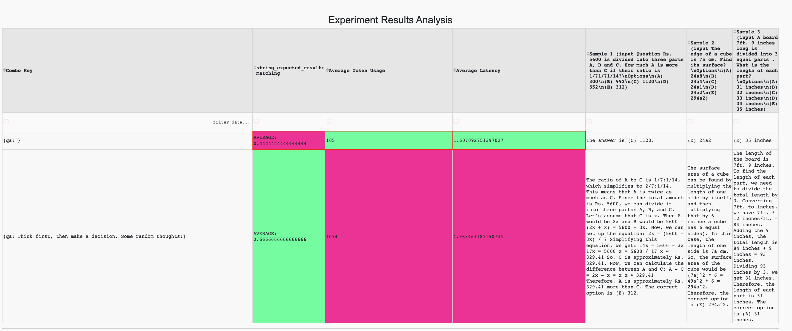

# Examples 

YiVal offers a user-friendly guide to help you get started with the platform. Explore a selection of step-by-step tutorials and real-life examples below showcasing the versatile applications of YiVal:

- **🤖 Headline Generation for a Startup Company** 
- **🐯 Animal Story Generation with MidJourney** 
- **📈 Comparison of LLM Model Evaluations**
- **🕹️ YiVal's Basic Interactive Mode**

## 🤖 Headline Generation for a Startup Company 

 Startup companies often invest a significant amount of time and effort into creating the perfect homepage headline that suits their brand. Yival can assist with generating these headlines using a selected machine learning model such as GPT-4 by compiling through different combinations of the generated data. Later, we can select an evaluator such as the Analytic Hierarchy Process (AHP) to pinpoint the ideal headline for a startup company’s website. 


 Please take a look at [this notebook](https://colab.research.google.com/drive/1EiWUL8rE_kfNLXVPowCWCh6hwHFagvs_?usp=sharing#scrollTo=C18fsKz315Zb) to view the implementation of headline generation for a startup company.

 To generate the proper prompts, we recommend using a step-by-step optimization pipeline mode, a method that continuously adjusts itself based on the test case results. Here you can find an example: [Notebook](https://colab.research.google.com/drive/1tr5s_adAPmI9Mv6Zz97JnTGIh3mGojsi?usp=sharing#scrollTo=zaN_U0WxNVex)

## **🐯 Animal Story Generation with MidJourney** 

  Generating compelling visuals for a narrative can be quite demanding, but with YiVal's AI optimization framework, it becomes a remarkably straightforward task. In this demo, you only need to input the initial prompt, and YiVal will automatically generate a variety of animals with unique personalities, and craft charming and concise animal stories using various templates. In addition, Midjourney is employed to create the  accompanying images. What's truly remarkable is that this entire process is fully automated, requiring just your initial prompt. 



 Please take a look at [this notebook](https://colab.research.google.com/drive/1DgtDZghleiLEaaNF7f4vSGJ4ChDVls2X?usp=sharing) to view the implementation of animal story generation with MidJourney.

##  **📈 Comparison of LLM Model Evaluations**

 NLP practitioners often face the challenge of assessing various models' capabilities. Yival provides a variety of generalized evaluation methods, by simply requiring the provision of data and configuration files. In this demo, we performed a side-by-side comparison of the QA abilities of the following four models: 

- **GPT-3.5-Turbo**
- **Llama-2-13b-chat**
- **Llama-2-70b-chat**
- **Vicuna-13b**



Please take a look at [this notebook](https://github.com/YiVal/YiVal/blob/master/demo/tutorial_notebook/model_comparison.ipynb) to view the implementation of animal story generation with MidJourney.

## **🕹️ YiVal's Basic Interactive Mode**

### Basic Interactive Mode

 To get started with a demo of the basic interactive mode of YiVal, simply run the following command:

```Bash
yival demo --basic_interactive
```

 Once started, navigate to the following address in your web browser: http://127.0.0.1:8073/interactive


### Question Answering with Expected Result Evaluator

 Similarly, as above, use the command below to get started with Question Answering with Expected Result Evaluator demo:

```Bash
yival demo --qa_expected_results
```

 Once started, navigate to the following address in your web browser: [http://127.0.0.1:8073](http://127.0.0.1:8073/)

