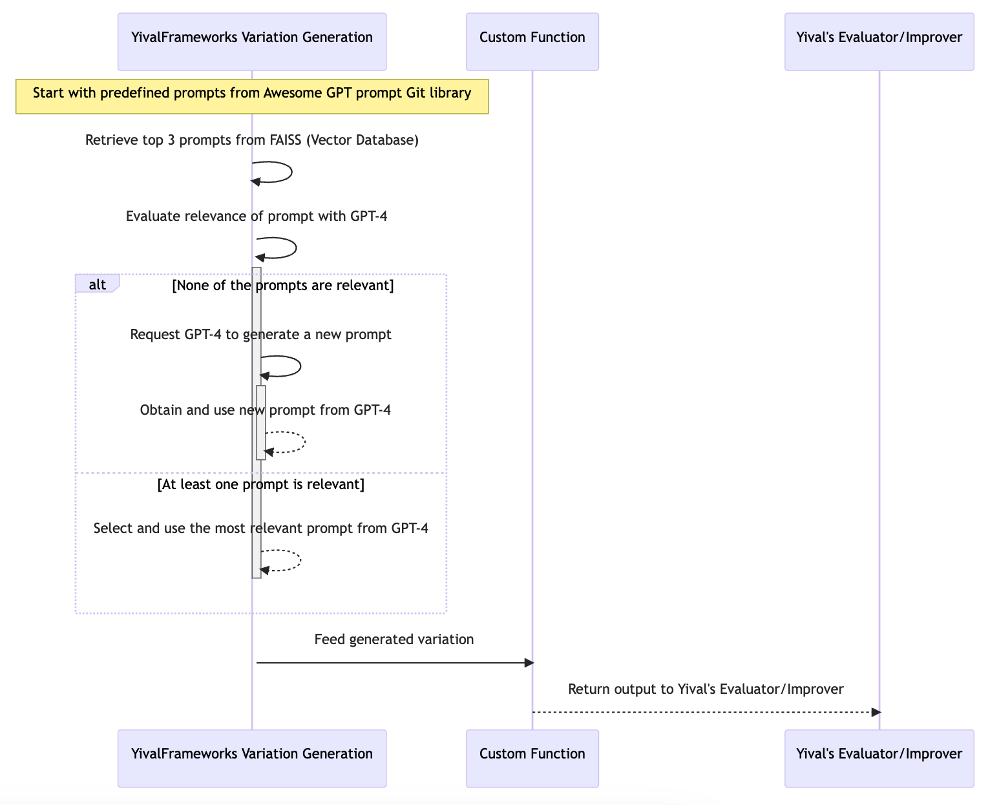
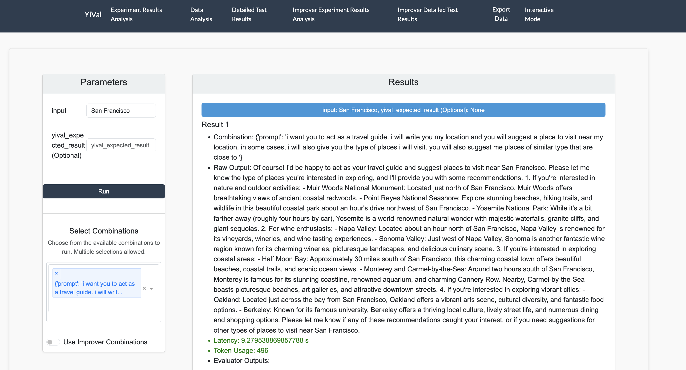

# Getting Started 

YiVal is easy to set up and use. Here, we will explore using YiVal's framework and Facebook AI Similarity Search (FAISS) library to Simplify Prompt Generation for LLMs with Retrieval Methods. Automating and optimizing this task using YiVal will ensure the generation of contextually relevant prompts. 

## Prerequisites & Installation

After making sure we have all the **prerequisites** to install YiVal, we begin installing YiVal using any of the methods mentioned in Section **Installation Methods**.

## YiVal's Role in Retrieval

In this task, we use FAISS to store prompts to be able to quickly search and retrieve the prompts. In addition, FAISS allows us to turn prompts into vectors, which facilitates finding the ideal prompt. YiVal simplifies experimentation with AI applications and tasks while being integrated with FAISS, in two main ways: 

1. **Find Matching Prompts**: Based on a given situation, Yival searches the FAISS database to find similar prompts.
2. **Refine with GPT**: Sometimes, the initially found prompts might not be perfect. So, we use GPT to rerank them, ensuring that we pick the most suitable one.



## Generating Prompts

Putting this all together alongside using ChatGPT 3.5 would look like:

```Python
# Create a chat message sequence
messages = [{
    "role": "user",
    "content": str(StringWrapper("", name="prompt")) + f'\n{input}'
}]

# Get a response from ChatGPT
response = openai.ChatCompletion.create(
    model="gpt-3.5-turbo", messages=messages
)
```

 Notice that there was no need to provide a predefined prompt using this approach. 

## **YiVal Configuration File** 

 Now, we start working on creating a YiVal configuration file. Here is an example of YiVal Configuration file for `travel guide` use case: 

```YAML
custom_function: demo.auto_prompt_bot.reply
dataset:
  source_type: user_input
description: Basic config for interactive mode
evaluators: []

custom_variation_generators:
  retrivel_variation_generator:
    class: demo.prompts_retrivel.retrivel_variation_generator.RetrivelVariationGenerator
    config_cls: demo.prompts_retrivel.retrivel_variation_generator_config.RetrivelVariationGeneratorConfig

variations:
  - name: prompt
    generator_config:
      use_case: "travel guide"
    generator_name: retrivel_variation_generator
```

 Here we have specified the dataset to be from user input and used `demo.auto_prompt_bot.reply` as a custom function and used `retrivel_variation_generator` to generate a prompt related to `travel guide` use case.

## Real-Time Results

 You can see the results achieved in real-time below. Please check this [notebook](https://colab.research.google.com/drive/1L7miRwTQSZfm5xOKBakWOG5bOumMynpv?usp=sharing#scrollTo=r5I9F1kJlSj2) to learn about this process in further detail.


